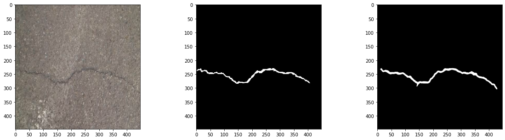
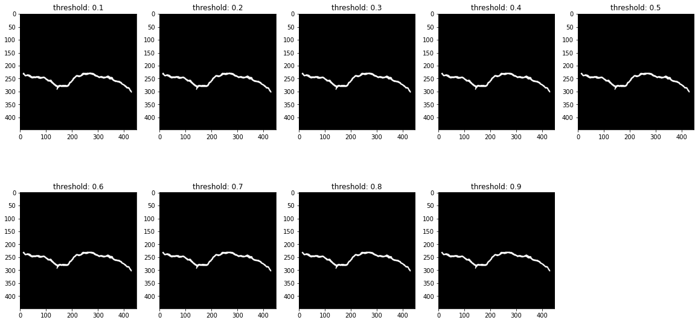

# crack-segmentation-keras


### Deep learning framework
Tensorflow : 2.15.0  
Keras : 2.15.0

## 準備Dataset
這是一個語意分割任務，需要準備要訓練的圖片和對應的label。

訓練原圖是RGB，有3個channel的圖片  
  

對應的裂縫label是只有1個channel的圖片  
  

## 安裝環境   
```
pip install -r requirements.txt
```

## 訓練模型
正式進行訓練之前可以先修改 `config.py` 來設定全域變數。
```
python train.py
```
會印出訓練時每個Epoch的Loss和Dice Coefficient記錄。

每個Epoch的Loss  
  

每個Epoch的Dice Coefficient  
  

## Inference
可以指定對單張圖片預測或是整個資料夾做預測
```
python predict.py --image_path path/your/image.jpg --model_path seg.h5
```
最左為原圖片，中間為Ground Truth，右邊為模型的預測結果。
  

對圖片的預測結果進行門檻值處理，顯示不同門檻值下的二值化預測結果。  
  


